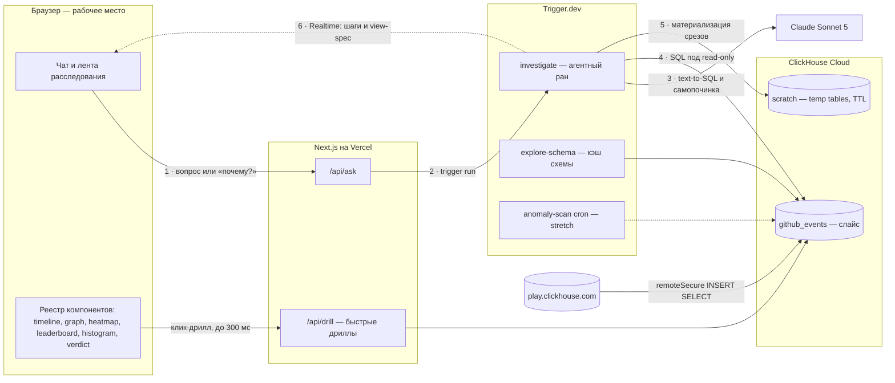

# Insight Desk — рабочее место оператора платформы

> Хакатон · Beyond the Wall of Text · ClickHouse + Trigger.dev

Чат-агент над `github_events`, где ответ — не текст, а интерактивное расследование: каждый
визуальный элемент кликабелен, каждый клик открывает следующий слой, финал — карточка-вердикт.
Центральный сюжет демо — накрутка звёзд: настоящий фрод в настоящих данных.

- Команда: 2–3 человека, выходные
- Датасет: `github_events` (слайс в своём ClickHouse Cloud)
- LLM: Claude Sonnet 5
- Сдача: публичный деплой (Vercel + Trigger.dev cloud + ClickHouse Cloud) + видео 2–3 мин

---

## Схема системы



- **1–6** — путь вопроса: агент как durable-ран Trigger.dev, шаги стримятся в браузер через Realtime.
- **Клик-дрилл** — быстрый путь: очевидные раскрытия идут мимо LLM, параметризованным SQL напрямую.
- **remoteSecure** — разовая загрузка слайса из публичного плейграунда в свой инстанс (нужен для temp tables).

## Конвейер агента (`investigate`)

| # | Шаг | Что происходит |
|---|---|---|
| 01 | Exploration | `DESCRIBE`, сэмплы, кардинальности ключевых колонок. Один раз, кэш в `scratch.schema_context` |
| 02 | Генерация SQL | Промпт = вопрос + контекст клика + схема + каталог view-spec. Модель выбирает компонент и пишет SQL под его форму данных |
| 03 | Ревью запроса *(stretch)* | LLM-as-judge: корректность, стоимость (нет full-scan без фильтра по времени), семантика |
| 04 | Исполнение | Read-only юзер, `max_execution_time`, лимиты строк и памяти |
| 05 | Самопочинка | Ошибка ClickHouse возвращается модели как контекст, до 3 попыток. В демо — видимый шаг, а не позор |
| 06 | Temp tables | При смене угла анализа — `CREATE TABLE scratch.t_… AS SELECT` с TTL; дальше агент запрашивает свой срез |
| 07 | View-spec | Данные + выбранный компонент + короткий инсайт-заголовок уходят в ленту. Текст — гарнир, не блюдо |

## Контракты — заморозить на J1, сб утром

Единственная точка связи всех трёх треков. Zod-схемы живут в общем пакете, их импортируют
и агент (валидация выхода LLM), и рендерер.

```ts
// ViewSpec — что агент отдаёт, а UI рендерит
type ViewSpec =
  | { kind: 'timeline';    title: string; series: Series[]; anomalyWindow?: [string, string]; clicks: ClickTarget[] }
  | { kind: 'leaderboard'; title: string; columns: Column[]; rows: Row[]; clicks: ClickTarget[] }
  | { kind: 'histogram';   title: string; bucketLabel: string; buckets: Bucket[]; clicks: ClickTarget[] }
  | { kind: 'graph';       title: string; nodes: GraphNode[]; edges: GraphEdge[]; maxNodes: number }
  | { kind: 'heatmap';     title: string; xLabels: string[]; yLabels: string[]; cells: Cell[]; clicks: ClickTarget[] }
  | { kind: 'verdict';     verdict: string; confidence: 'low' | 'medium' | 'high'; evidence: Stat[] };

// ClickContext — что уходит из UI при клике по элементу
type ClickContext = {
  cardId: string;
  componentKind: ViewSpec['kind'];
  selection: Record<string, string | number>;  // напр. { repo: 'x/y', day: '2024-03-02' }
  action: 'drill' | 'why';                     // drill → /api/drill, why → новый ран агента
};

// Drill API — быстрый путь без LLM
// POST /api/drill  { drillId: 'stars-by-account', params: {…} }  →  { viewSpec: ViewSpec }
```

## Декомпозиция по трекам

### Трек A — Данные / ClickHouse (человек 1)

| ID | Задача | Оценка | Зависит |
|---|---|---|---|
| A1 | Инстанс ClickHouse Cloud; юзеры `agent_ro` и `agent_scratch`; база `scratch` с TTL по умолчанию | 2 ч | — |
| A2 | Перелив слайса `github_events` через `remoteSecure` (запустить фоном первым делом); фоллбек — GH Archive за узкое окно дат | 1–2 ч + фон | A1 |
| A3 | Валидация сигнала: найти 2–3 реально накрученных репо, «золотые запросы» — таймлайн звёзд, профиль возраста аккаунтов, матрица ко-старинга | 3 ч | A2 |
| A4 | Параметризованные drill-запросы под клик-цели каждого компонента | 3 ч | J1 |
| A5 | Перф-проход: rollup «звёзды/день/репо», профили настроек и лимиты для `agent_ro` | 2 ч | A3 |
| A6 | SQL-детекторы для anomaly-scan *(stretch)* | 2 ч | A3 |

### Трек B — Агент / Trigger.dev (человек 2)

| ID | Задача | Оценка | Зависит |
|---|---|---|---|
| B1 | Скелет: Next.js + Trigger.dev init, env, деплой-пайплайн (Vercel + Trigger.dev cloud) | 2 ч | — |
| B2 | Таска `explore-schema`: DESCRIBE + сэмплы + кардинальности → JSON-контекст в `scratch` | 2 ч | A1 |
| B3 | Таска `investigate`: вход (вопрос + ClickContext), стрим шагов через Realtime, выход `ViewSpec[]` | 3 ч | B1 · J1 |
| B4 | Промпт text-to-SQL: схема + каталог view-spec, модель выбирает компонент и форму данных | 3 ч | B2 · B3 |
| B5 | Обёртка исполнения: read-only клиент, таймауты, захват ошибок → цикл самопочинки (до 3 попыток) | 2 ч | B4 |
| B6 | Temp tables: `CREATE … AS SELECT` в `scratch`, TTL, использование в следующих шагах рана | 2 ч | B5 |
| B7 | `/api/ask` + выдача public access token для Realtime-подписки | 1 ч | B3 |
| B8 | Шаг LLM-as-judge в конвейере *(stretch)* | 2 ч | B5 |
| B9 | Cron `anomaly-scan` + алерт-карточки в ленту *(stretch)* | 3 ч | A6 · B7 |

### Трек C — UI / Компоненты (человек 3)

| ID | Задача | Оценка | Зависит |
|---|---|---|---|
| C1 | Каркас «рабочего места»: лента расследования + композер, тёмная тема как базовая | 2 ч | B1 |
| C2 | Realtime-хук + прогресс конвейера: видимые шаги «изучаю схему → пишу SQL → выполняю», превью SQL | 2 ч | B7 |
| C3 | Рендерер view-spec + zod-контракты в общем пакете | 2 ч | J1 |
| C4 | Компоненты v1: Timeline с зоной аномалии, Leaderboard, VerdictCard | 4 ч | C3 |
| C5 | Компоненты v2: NetworkGraph (cap top-N), Histogram, CalendarHeatmap | 4 ч | C4 |
| C6 | Клики: click-target → ClickContext → drill API или «почему?» → новый ран агента | 2 ч | C4 · A4 |
| C7 | Полировка: состояния загрузки и ошибок, фоллбек-карточка «не смог — вот что пробовал», демо-стайлинг | 3 ч | C5 |

### Вместе

| ID | Задача | Когда |
|---|---|---|
| J1 | Заморозка контрактов: ViewSpec, ClickContext, drill API | сб утро, 1 ч |
| J2 | Интеграционный чекпоинт: первый end-to-end «вопрос → карточка» | сб вечер |
| J3 | Сценарий демо + запись видео 2–3 мин | вс день |
| J4 | README, сабмишн, проверка публичной ссылки со свежего устройства | вс день |
| J5 | Прогон свежим взглядом; список накрученных репо — под рукой у ведущего демо | вс вечер |

> Если вас двое: трек C делит участник трека B после J1, компоненты v2 (C5) уходят в stretch,
> граф связей остаётся — он несёт кульминацию сюжета.

## Таймлайн выходных

| Слот | A · Данные | B · Агент | C · UI | Вместе |
|---|---|---|---|---|
| пт вечер | A1 | B1 | C1 | |
| сб утро | A2 запущен фоном | B2 · B3 | C2 · C3 | **J1** контракты |
| сб день | A3 | B4 · B5 | C4 | |
| сб вечер | A4 | B7 | C4 | **J2** end-to-end |
| вс утро | A5 | B6 | C5 · C6 | |
| вс день | стретчи, если зелёные | стретчи, если зелёные | C7 | **J3–J5** видео, сабмишн |

> **Критический путь:** A2 (перелив слайса) → A3 (сигнал накрутки виден) → всё демо.
> Загрузку данных запускаем раньше всего остального; пока она идёт — треки B и C работают
> на публичном плейграунде.

## Риски и митигации

| Риск | Митигация |
|---|---|
| Слайс грузится дольше плана | Стартуем в первую очередь; фоллбек — сузить окно дат и типы событий до WatchEvent + CreateEvent |
| Сигнал накрутки не виден в слайсе | Репо выбираем заранее по публичным спискам fake-stars и подгоняем слайс под них, а не наоборот |
| Латентность конвейера (несколько LLM-ходов) | Шаги видимы через Realtime — ожидание становится частью зрелища; exploration кэширован; Sonnet 5 за скорость |
| Кривой SQL на свободном вопросе жюри | Самопочинка до 3 попыток + фоллбек-карточка «показать, что пробовал» вместо пустого экрана |
| Граф тормозит на больших данных | Жёсткий cap top-N узлов по скору подозрительности, задан в контракте `maxNodes` |
| Realtime не завёлся на деплое | Деградация до поллинга статуса рана — интерфейс тот же, теряем только плавность |

## Маппинг на критерии жюри

| Критерий | Вес | Чем закрываем |
|---|---|---|
| Use of ClickHouse + Trigger.dev | 25% | Реальный датасет миллиардного масштаба; temp-table workspace агента прямо в базе; durable-раны + Realtime-стриминг; cron-скан в stretch |
| Problem fit | 20% | Задокументированный реальный фрод (накрутка звёзд); оператор получает вердикт, а не простыню текста |
| Technical implementation | 20% | Схемо-агностичный research-агент: exploration → SQL → самопочинка; типизированный view-spec реестр |
| Innovation | 20% | Клик по визуализации — ход диалога; агент материализует себе рабочие таблицы |
| Scalability & impact | 10% | Подключается к любому ClickHouse без переделки — агент сам исследует схему |
| Presentation | 5% | Публичная ссылка + видео-расследование на 2–3 минуты |

**Питч-мостик в финале:** система схемо-агностична — «подключите сюда потоки клиентов брокера,
и это рабочее место комплаенс-оператора биржи». Исходная трейдинг-идея возвращается как roadmap,
а накрутка звёзд структурно и есть wash-trading.
